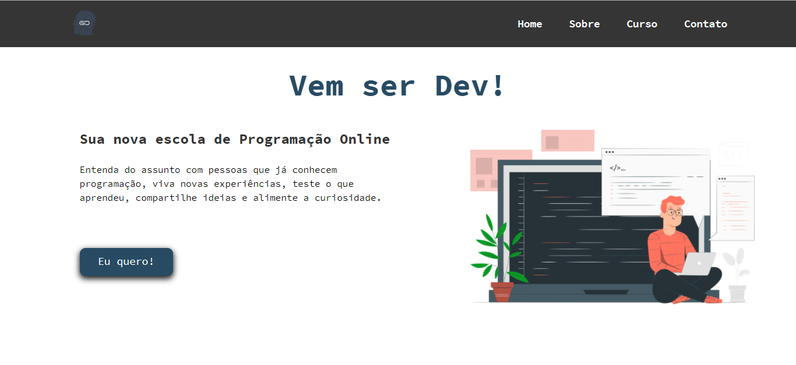

<div align="center" id="top"> 


</div>

<h1 align="center">Gerador de Devs</h1>

<p align="center">
  <a href="#dart-sobre">Sobre</a> &#xa0; | &#xa0; 
  <a href="#rocket-tecnologias">Tecnologias</a> &#xa0; | &#xa0;
  <a href="#white_check_mark-pré-requesitos">Pré requisitos</a> &#xa0; | &#xa0;
  <a href="#checkered_flag-começando">Começando</a> &#xa0; | &#xa0;
  <a href="#memo-licença">Licença</a> &#xa0; | &#xa0;
  <a href="https://github.com/gsmenezes" target="_blank">Autor</a>
</p>

<br>

## :dart: Sobre ##

Site desenvolvido para a Escola Gerador de Devs.     
A Gerador de Devs tem a missão de preparar pessoas para o mercado de trabalho, através da tecnologia.   
Os cursos são 100% gratuitos, com aulas do básico ao avançado em Back-end e Front-end.

## :rocket: Tecnologias ##

As seguintes ferramentas foram usadas na construção do projeto:

- [Node.js](https://nodejs.org/en/)
- [React](https://pt-br.reactjs.org/)
- [TypeScript](https://www.typescriptlang.org/)

## :white_check_mark: Pré requisitos ##

Antes de começar :checkered_flag:, você precisa ter o [Git](https://git-scm.com) e o [Node](https://nodejs.org/en/) instalados em sua maquina.

## :checkered_flag: Começando ##

```bash
# Clone este repositório
$ git clone https://github.com/gsmenezes/geradordevs

# Entre na pasta
$ cd geradordevs

# Instale as dependências
$ yarn

# Para iniciar o projeto
$ yarn start

# O app vai inicializar em <http://localhost:3000>
```

## :memo: Licença ##

Este projeto está sob licença MIT. Veja o arquivo [LICENSE](LICENSE.md) para mais detalhes.

<div align="center"> 
Feito com :heart: por <a href="https://github.com/gsmenezes" target="_blank">gi menezes</a>
</div>
